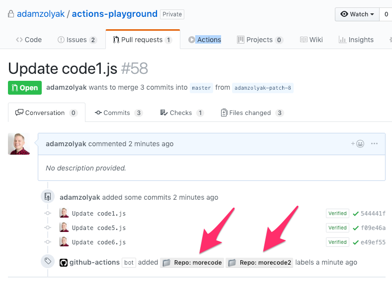
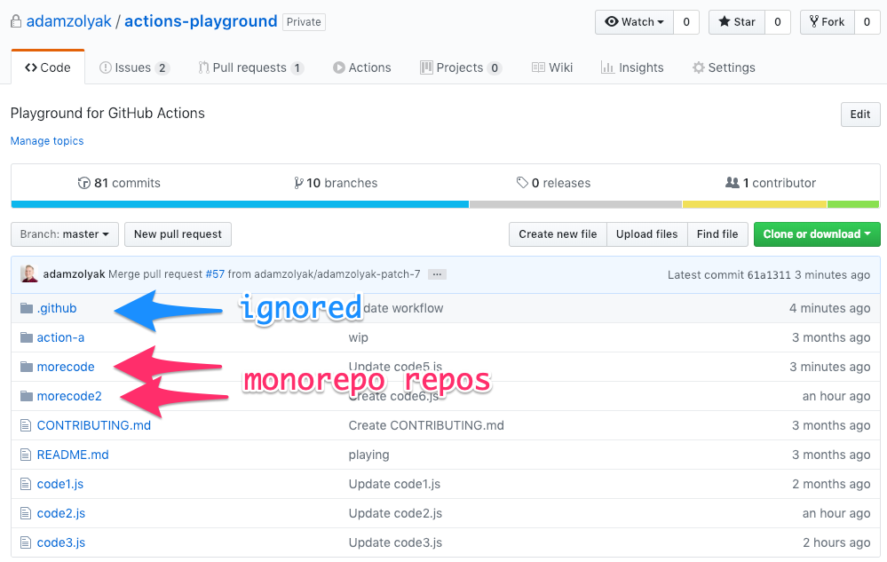

# 🚊 Monorepo PR Repo Labeler - GitHub Action

A [GitHub Action](https://github.com/features/actions) that labels pull requests with the modules(s) that are impacted in a [monorepo](https://en.wikipedia.org/wiki/Monorepo).

## How It Works

This GitHub Action runs when an [`pull_request` event webhook](https://developer.github.com/v3/activity/events/types/#issuesevent) is fired in your GitHub repo. The action checks if any of the files in the pull request are in a module (ex. `/directory1/...` from the root of the monorepo). If one or more modules are found, the pull request is labeled with a label for each module repo. Directories that beging with a dot (ex. `/.directory/`) are ignored. The action also supports configuring a list of one or more base directories if modules are within base directories (ex. `/.directory/directory/`) such as within [Lerna projects](https://github.com/lerna/lerna).

## Examples

Example of PR that has changes in two modules:


Example of monorepo module structure:


## Installation

To use this GitHub Action, you must have access to [GitHub Actions](https://github.com/features/actions). GitHub Actions are currently only available in private beta (you must [apply for access](https://github.com/features/actions)) and only work in private repos.

To setup this action:

1. Create a `.github/worksflows/main.yml` in your GitHub repo ([more info](https://help.github.com/en/articles/configuring-a-workflow)).
2. Add the following code to the `main.yml` file and commit it to the repo's `master` branch.

```yaml
name: Monorepo PR Repo Labeler

on: pull_request

jobs:
  labelPR:
    name: Label PR With Repo(s)
    runs-on: ubuntu-latest
    steps:
      - name: Label PRs
        uses: adamzolyak/monorepo-pr-labeler-action@patching
        env:
          GITHUB_TOKEN: ${{ secrets.GITHUB_TOKEN }}
          BASE_DIRS: 'directory1|directory2'
```

Optionally add a `BASE_DIRS` variable under `env` if modules are located within a base directory(ies). You can configure one (ex. `directory1`) or more directories (ex. `directory1|directory2|...`).

3. Whenever you open, edit, close, etc a pull request, the action will run!

## Contributing

If you have suggestions for how this GitHub Action could be improved, or want to report a bug, open an issue! Or pull request! We'd love all and any contributions. For more, check out the [Contributing Guide](CONTRIBUTING.md).

## License

[ISC](LICENSE) © 2019 Adam Zolyak <adam@tinkurlab.com> (www.tinkurlab.com)
